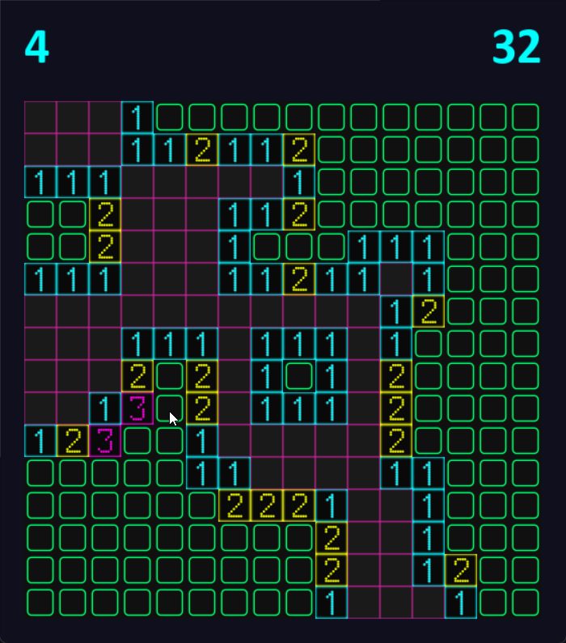

# Cyber Minesweeper 🚩💻

## About the Game
Cyber Minesweeper is a modern, cyberpunk-themed take on the classic Minesweeper game. Developed using Pygame, this version offers a sleek, futuristic interface with multiple difficulty levels and a custom grid configuration option.

## Features
- 🎮 Three difficulty levels: Facile, Moyen, Difficile
- 🏗️ Sandbox mode for custom grid configuration
- 🕹️ Cyberpunk-inspired UI with glitch effects
- 📊 Hall of Fame to track top performances
- 🌈 Responsive grid sizing

## Prerequisites
- Python 3.12+
- Pygame library

## Installation

### 1. Clone the Repository
```bash
git clone https://github.com/RyderBlack/minesweeper.git
cd minesweeper
```

### 2. Install Dependencies
```bash
pip install pygame
```

### 3. Run the Game
```bash
python main.py
```

## Game Modes
- **Facile**: 10x10 grid with 10 mines
- **Moyen**: 16x16 grid with 32 mines
- **Difficile**: 20x20 grid with 100 mines
- **Sandbox**: Create your own grid configuration

## How to Play
- **Left Click**: Reveal a cell
- **Right Click**: Flag/Question mark a cell
- **R Key**: Restart game when game is over

## Customization
- Add custom background image in `assets/background.png`
- Modify difficulty presets in `main.py`
- 
## Screenshots


## Contributions
Contributions are welcome! Please feel free to submit a Pull Request.

## Credits
Developed with ❤️ using Python and Pygame
